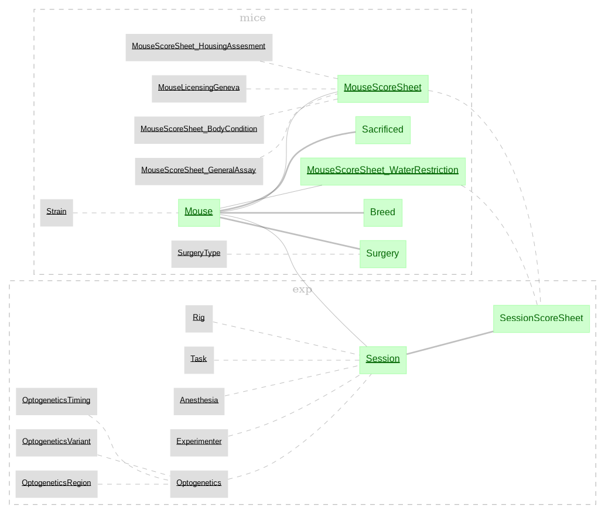

# Mathis lab base tables for all DataJoint pipelines

The `base_schemas` folder is a python package that contains the definition of main schemas (ensemble of tables) that are shared across distinct pipelines. The actual main schemas are `mice` and `exp`, and they are illustrated in the following diagram:



Main schemas definitions should be the same for all pipelines, so the organization via separate package helps to isolate the code during development and deployment.

## Installation

### From source code

For the development version, clone the repository, and run

```
# for development
pip install -e .

# for usage
pip install .
```

Alternatively, the package can be directly installed using one of the following commands (`main` can be replaced by a commit hash or branch):

```
pip install "git+ssh://git@github.com/SCENE-Collaboration/Base-schemas.git@main"
pip install "git+https://github.com/SCENE-Collaboration/Base-schemas.git@main"
```

### Building a distribution

To build an installable package (source release or wheel), run:

```
pip install build
python -m build .
```

which will create the release files in the `dist/` subfolder.
For example, for version "1.1.0", it will create:

```
dist
dist/base_schemas-1.1.0.tar.gz
dist/base_schemas-1.1.0-py3-none-any.whl
```

The wheel can be directly installed with pip:

```
pip install dist/base_schemas-1.1.0-py3-none-any.whl
```

This workflow is useful when e.g. distributing package versions for use within a Docker container.

## Usage

``` python
from base_schemas.schemas import mice, exp
print(mice.Mouse())
```

## Acknowledgments

We thank Prof. Mackenzie Mathis, Dr. Tanmay Nath, Dr. Gary Kane, and Dr. Mariia Popova for their early contributions to this codebase, which helped establish the foundation of the shared schemas used across pipelines.
